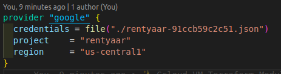

# terraform-gcp

Using `terraform-provider-aws_5.3.0`

## Setup GCloud Env in your system

Run and install Google Cloud SDK `curl https://sdk.cloud.google.com | bash`

Then run this command and follow the instructions `gcloud init`

Then follow these below steps in Google Cloud Console:

1. Create a project and name it whatever you’d like.

2. Create a service account and specify the compute admin role.

3. Download the generated JSON file and save it to your project’s directory. After that import that JSON file like this into your terraform project. **Be sure not to push that JSON file in Github repositories.**
   

## Terraform commans to remember

```bash
terraform validate  #Validates the code for syntax errors
terraform init  #Initializes the configuration
terrraform plan #Check what changes will be made with your code
terraform apply  #Apply the configuration
terraform destroy #Destroy the configuration
```
